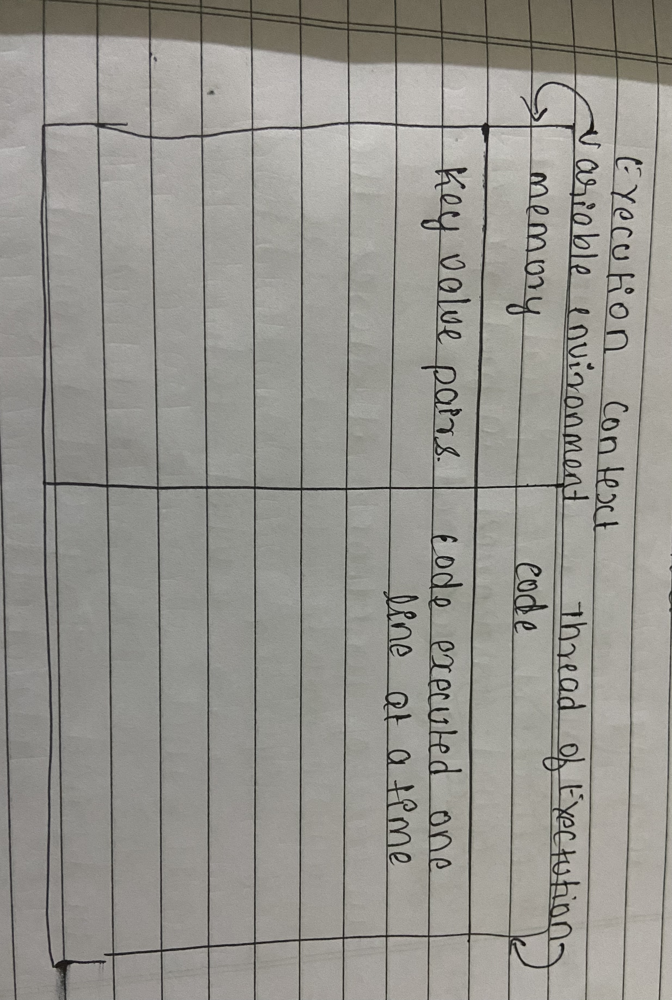

# Chapter - 01
## How javascript works

# "Everything in javascript Happens inside execution context"

# "Javascript is a sychronous signle threaded language"

single threaded means -> executing line by line or one command once at a time

javascript goes to nextline only when the first line is executed completely

javascript is not possible without execution context

