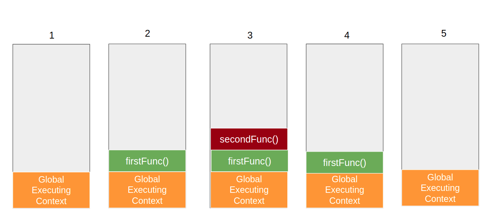

# Chapter - 02 How JavaScript Code is executed?

- Execution Context and Phases
    JavaScript code is executed in execution contexts.
    Execution contexts have two phases: memory creation and code execution.

 - Memory Creation Phase
    In the memory creation phase, memory is allocated to variables and functions.
    Variables are assigned the value of undefined.
    Functions are stored in memory as they are.

 - Code Execution Phase
   - In the code execution phase, the code is executed line by line.
    Variables created in Memory Creation Phase start assigning value as code executed.
    Functions are invoked by creating a new execution context (Global Execution Context).
    The execution context has its own memory and code components.
    Code inside the function is executed.
    return statements return control to the invoking context.
    Return values are stored in memory if stored in variable.
    The execution context is deleted after the function finishes.    

    

  - Execution Context Working
    Call Stack
    The call stack manages the execution contexts.
    It maintains the order of execution of execution contexts.
    Each new execution context is pushed onto the stack.
    The topmost execution context is the one currently being executed.
    The bottom execution context is the Global Execution Context and others are Function EC.
    When a function finishes, its execution context is popped from the stack.
    Eventually GEC is also popped from the stack, Execution of program completed.  

    

     [Watch how execution context is created](https://www.youtube.com/watch?v=iLWTnMzWtj4&t=1s)

